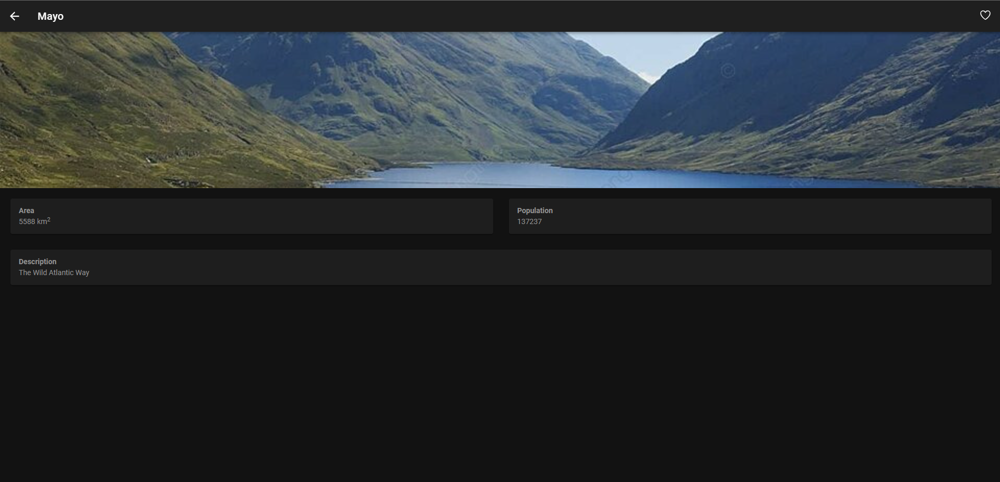

# Final Project

**Title:** County Explorer (County Details)

**Name:** Chayapol "Due" Hongsrimuang

**Student ID:** G00388741

**Screencast:** https://atlantictu-my.sharepoint.com/:v:/g/personal/g00388741_atu_ie/EY4NVACi0wNNq9IKeIxEfrQBOk4QjRKZAWgfo4GxmGAGOA?e=lXMALK

## Running the Application

```MARKDOWN
    1. Navigate to to the source folder - cd CountyExplorer
    2. Install required resources - npm install
    3. Install Angular CLI - npm install -g @angular/cli
    4. Log in to Firebase - firebase login
    5. Run the application - ionic serve
    6. The application can be accessed by the forwarded port address, both in phone's browser or main desktop browser.
```

## Application Functionality and Architecture

This application displays some details about each of the counties in Ireland. There are 7 counties that are in the database that can be viewed and choose from. There are four tabs that are involved in the functionality of this application.

The following picture describes the architectectural overview of the application, connecting the application with Firebase. All details about each tabs responsible are below this picture


### Home Tab
The home tab consists of the **favourites list** and your **county of the moment**. The **favourites list** would display any of a logged-in user's favourited counties. (in its card form) The **county of the moment** is a randomly chosen county that is from the counties list in the database.


### Search Tab
The search tab consists of all the counties in the database in its card form. Users can view the details of a county, by clicking on "More Info" on the respective county card. Users can also search for a county by typing in the search bar.


### Map Tab
The map tab consists of a map provided by Capacitor's Google Maps plugin and geolocation. The map is automatically centred according to your GPS location. All the counties in the database are given their respective marker in their respective location. Clicking on a marker will give the user the details of the county selected.


### User Tab
The user tab consists of some possible user management functions. When signed out, the user can sign in with their credentials (email and password) or register with an email, password and a username, following these requirements:
* The email must be in a valid email format. 
* The username must be longer than or equal to 3 characters.
* The password must be longer than or equal to 8 characters.

Once logged in or registered, the user can have access to the favourites feature. They can also sign out by clicking on the sign out button. All of these are achieved by Firebase's authentication service.


### County Details Page
This page is opened upon either clicking the "More Info" button in the county's card or clicking a marker in the map tab. This page shows some details about the county as well as a picture from Firebase Storage. All details are stored in Firebase's Firestore service.

Logged-in users can also favourite/unfavourite their desired county as well by clicking on the heart button on the top right corner. The results of this are shown in the home tab.



### Services
There are a total of five different services that help service this application from the front-end to Firebase:
* **auth** = contains authentication services in regards to logging or registering with emails and passwords.
* **database** = contains Firestore services in regards to the ```county``` collection. Contains retrieval of the data from the collection.
* **favourites** = contains Firestore services in regards to the ```favourites``` collection. Contains retrieval of the data from the collection as well as modification of the collection (adding and removing) Works in conjunction with the authentication background.
* **storage** = contains Firebase Cloud services, getting a county image from the storage itself.
* **users** = contains Firestore services in regards to the ```user``` collection. Contains retrieval of the data in regards to the users of the application, matching the user's data with the current logged-in user's ID.

## Minimum Project Requirments

Confirm and demonstrate how you have met all minimum project requirements:

* The project, including code and documentaion, will be fully contained in the provied Git repo.
* The project **MUST** contain a working Ionic Angular app which matches the app you chose.
* The Ionic app must include the use of the Angular Router, Connection to a Backend service such as Firebase or Supabase, Use of a Capacitor native plugin.
* The app must not resemble in any way an app you have previously developed for another module or are currently developing for any project. 
* The code MUST compile. 30% grade reduction if code does not compile when I issue the ionic serve command. 
* The application code must be formatted in a consistent and standard way.
* The code must contain comments. One comment per class, method and variable at minimum.
* There must be two commits per week minimum (Note: Should be many commits per day coding).
* The documentation and commentary must be free of a grammar and spelling mistakes.

## Project Requirements above and beyond

This project implements additional Firebase services not typically covered, including Firebase's cloud storage, where background photos for each county are stored inside the storage system. 

Two Capacitor plugins are also used in conjunction with each other, those being Google Maps and Geolocation, to help display each county in the database. 

An Android build functionality has also been added with its permissions attached. However, no Android builds or build scripts have been produced or written.

## Roadblocks and Unfinished Functionality

One of the biggest roadblocks for this application is to try and hide the API key used to power the Google Maps functionality. Even though there are various ways to hide the API key, but these are beyond the scope of the project and the application, as it may require some additional architecture (i.e. another server) or other third-party services that may take more time to implement. 

Unfortunately, the API key is hard-coded in, but as this is a private repository with no purpose to go public, this can be considered fine, but can cause risk when this repository goes public. (in that case, the API key may have to be revoked)

When it comes the authentication part of the application, there is no ability to reset any passwords yet, as this may require another page write up and logic that can handle resetting passwords from emails and more.

There are some other functionalities that could be added as well, but can be considered as "out-of-scope", such as adding photos to each county, comments about each county, or list of attractions of each county. However, this may create unneeded complexity of the project, with the implementation of the same technology multiple times.

Other additional counties can also be added in as well, but as for demonstration of the app and the project itself, there are 7 sample counties that can be accessed from the database.

## Resources

* [Ionic Docs](https://ionicframework.com/docs/ja/v6/native/google-maps) - Integrating Google Maps to Ionic App
* [Stack Overflow](https://stackoverflow.com/questions/23150333/html5-javascript-dataurl-to-blob-blob-to-dataurl) - Converting a blob to an image URL. Used in converting counties images to display in pages. (only the question part)
